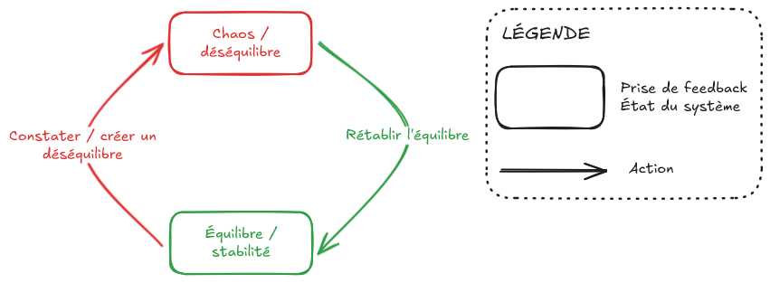

+++
date = '2025-04-05T05:55:25+02:00'
draft = false
title = 'Feedback rules (the world) - Partie 1 - prendre conscience'
+++

En anglais, feedback se traduit par *retour d'information*.

Cette notion de feedback est très connue dans le monde de la tech. Qui n'a jamais demandé un feedback à un collègue ou à un client ? 

Cependant, bien que souvent mentionné, présent dans certains concepts comme l'agilité, le feedback n'est pas maîtrisé à sa juste valeur.

C'est l'objectif de cet article, remettre en avant cet outil qui régit notre monde et que nous utilisons en permamence sans en avoir conscience.

# Introduction

## La nature du feedback

### Les cinq sens

L'être humain a cinq sens : *le goût, l'odorat, le toucher, l'ouie et la vue*. Ce sont eux qui régissent notre quotidien.

Si on touche une plaque brulante, on retire aussitôt notre main.
Si on est ébloui.e, on détourne le regard.

Nous recevons en permanence du feedback du monde extérieur.

### La pensée

A partir des informations obtenues grâce à nos cinq sens, nous pouvons à notre tour créer du feedback. Nous raffinons ces informations grâce à notre pensée, de cela en découle des décisions puis des actions qui créent un nouveau feedback que nous renvoyons au monde extérieur.

## Le passage à l'action

Sans feedback, pas d'action.

Si vous ne ressentez pas la chaleur, vous n'enleverez pas votre main de la plaque brulante.
Si vous ne voyez pas une lumière éblouissante, vous ne détournerez pas le regard.

Toutes les actions que nous effectuons à chaque instant se déclenchent parce que nous avons eu un feedback, la plupart du temps inconscient.

## Conscientiser le feedback

Heureusement pour nous, nous n'avons pas conscience de tous les phénomènes qui se passent dans notre corps ou dans le monde. Nous ne sommes pas en mesure de traiter une infinité d'information.

Traiter le feedback demande beaucoup d'énergie et nous avons appris à le faire de manière inconsciente.

Et si nous découvrions la stratégie du feedback ? 

# La stratégie du feedback

## L'univers est chaotique

Notre monde est complexe. Il se produit une infinité de choses en permanence. Nous n'avons pas les moyens de recevoir et traiter toutes ces informations.

Nous adaptons donc notre perception pour ne recevoir que les informations qui nous intéressent. Nous faisons le tri.

Il y a tout le temps quelque chose qui change, ces changements en entraînent d'autres. Mais il y a aussi certaines choses qui ne changent pas, qui ne changent plus. Nous pouvons constater la stabilité de ces choses, c'est aussi un feedback.

## Feedback binaire

La stratégie du feedback repose sur ce concept d'instabilité et de stabilité, de chaos et d'harmonie.

Il y a tellement d'informations que le plus simple est de faire le tri jusqu'à n'observer qu'une seule chose. En observant une seule chose à la fois, la prise de décision et le passage à l'action deviennent plus facile.

Cela ne signifie pas que l'on doit prendre qu'une seule information du feedback. Cela signifie que l'on doit adapter notre perception pour que l'on ait simplement à dire : *c'est vrai ou c'est faux*.

Par exemple, je souhaite traverser la route sur un passage piéton.

Mon feedback repose entièrement sur cette observation : est-ce que je suis de l'autre côté.

Tant que je ne suis pas de l'autre côté, je reste concentré sur l'action de traverser la route. Cela me force à aller en direction de l'autre trottoir, plutôt que de m'assoir sur le passage piéton.

Je reste attentif à ce qu'il se passe autour, pour éventuellement changer de priorité, mais ma priorité ne changera pas tant que je n'aurai pas traversé la route.

## Le schéma du feedback

La théorie du feedback repose sur le schéma suivant. Nous étudierons cette théorie dans les prochains articles.

## Conclusion
Nous n'avons pas conscience de l'énorme quantité d'informations qui flottent autour de nous en permanence. 

Savoir cela n'est pas très intéressant, sauf si cela nous permet d'établir des stratégies afin d'être plus efficace, plus rapide, plus qualitatif.

C'est ce que nous étudierons dans le prochain article
[Feedback rules (the world) - partie 2](../feedback_rules_the_world_part_2).
