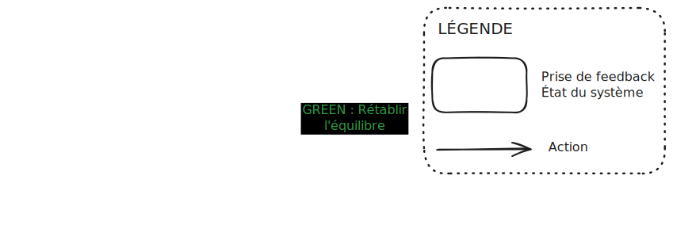
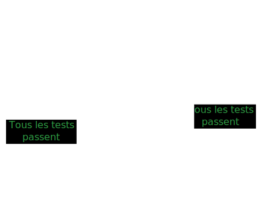
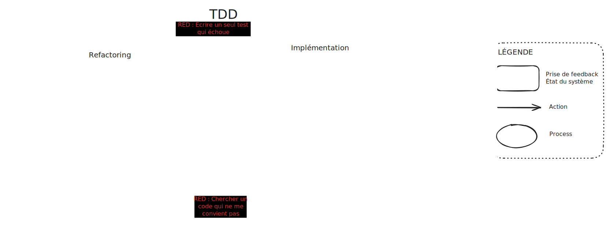
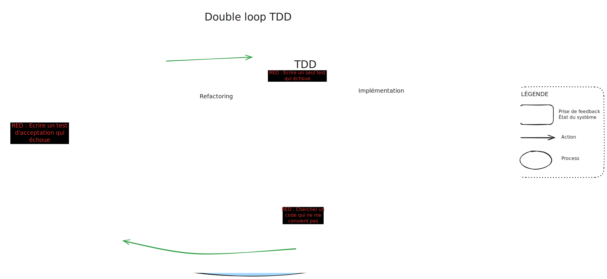
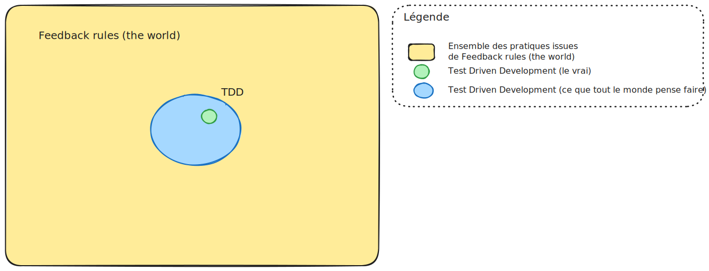

+++
date = '2025-04-06T08:07:52+02:00'
draft = false
title = 'Feedback rules (the world) - Partie 2 - TDD versus Feedback Rules'
+++

# Introduction

Dans [l'article précédent](../feedback_rules_the_world_part_1), nous avons découvert le schéma suivant : 

# Le cycle ok -> RED -> ko -> GREEN
Le cycle de **Feedback Rules (the world)** est constitué : 
- d'actions :
	- RED où l'on cherche à mettre en évidence un déséquilibre, voire le créer
	- GREEN où on rééquilibre les choses
- des états 
	- ok correspond à un système stable.
	- ko correspond à un système instable.

Tout cela constitue le cycle que l'on pourrait nommer : **ok -> RED -> ko -> GREEN**

# Test Driven Development (TDD)

Ce cycle **ok -> RED -> ko -> GREEN** ressemble énormément au cycle TDD que l'on appelle **RED - GREEN - REFACTORING**.

D'ailleurs, c'est la méthode *TDD* qui m'a inspiré cette série d'articles. 

Voici le schéma traditionnel de ce cycle : 

- Red : on met en place un test qui échoue
- Green : on fait passer le test
- Refactoring : on arrange le code

Reprenons maintenant ce schéma en se basant sur le concept **Feedback Rules** et découvrons ce que cela donne : 

.

Contrairement au schéma traditionnel de TDD, le feedback est mis en avant dans les cadres et les activités sont des flèches. 

En décrivant TDD à l'aide de Feedback rules (the world), nous constatons plusieurs choses : 
- TDD est un process composé lui-même de 2 process (Implémentation et refactoring) qui s'exécutent séquentiellement
- Il y a plusieurs sources de feedback : 
	- Les tests automatiques qui échouent ou passent
	- Le constat que le code me convient ou ne me convient pas

Cela met en évidence qu'il y a des choses qui sont faîtes inconsciemment. **Feedback Rules (the world)** est un outil qui permet de les mettre en évidence.

# Double loop TDD

Enrichissons notre vision avec un autre process : la double loop TDD.

Voici le schéma traditionnel : 

.

La double loop permet de travailler avec un test d'acceptation qui nous indique quand on a fini le travail. 

Utilisons **Feedback Rules (the world)** pour la schématiser : 

.

Nous voyons ici que le cycle TDD est imbriqué dans le cycle Double loop TDD.

# Les conclusions

Voici un schéma pour mieux cerner TDD par rapport à Feedback rules (the world) : 

.

*TDD* est un sous-ensemble de *FR(TW)*. Et ceux qui pensent faire du TDD est aussi un sous-ensemble de *FR(TW)* qui inclut lui-même TDD. 

Nous avons donc mis en évidence plusieurs choses : 

- Nous utilisons inconsciemment certains process
- Les process peuvent être : 
	- imbriqués
	- séquentiels
- Il existe plus d'une source de feedback, dont certaines inconscientes

Est-ce que nous pouvons en déduire des stratégies pour nous améliorer afin d'être plus efficace, plus rapide, plus qualitatif.

Nous verrons tout cela en détail dans [l'article suivant](../feedback_rules_the_world_part_3).
