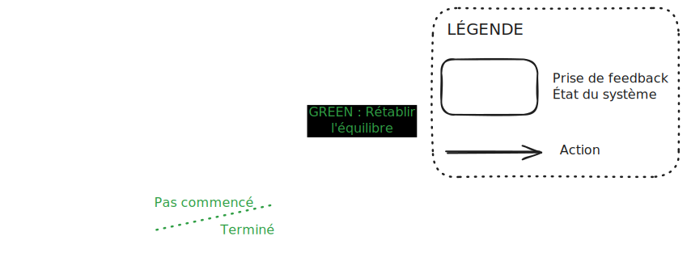

+++
date = '2025-04-06T08:07:52+02:00'
draft = false
title = 'Feedback rules (the world) - Partie 2 - TDD versus Feedback Rules'
+++

# Introduction

Dans [l'article précédent](../feedback_rules_the_world_part_1), nous avons découvert le schéma suivant : 

# Le cycle ok -> RED -> ko -> GREEN

L'étape RED correspond à l'action de mettre en évidence qu'il y a un déséquilibre.

L'étape GREEN est l'action de rééquilibrer.

ok et ko représentent l'état du système. Respectivement quand tout est OK et quand quelque chose ne va pas.

ok -> RED -> ko -> GREEN est le cycle lié à Feedback Rules.

# Test Driven Development

Ce cycle RED - GREEN ressemble énormément au cyle RED - GREEN - REFACTORING

Faisons un petit passage dans le monde du Test Driven Development (TDD). C'est cette méthode qui m'a inspiré cette série d'articles. 

TDD repose sur un cycle que l'on appelle Red - Green - Refactoring, le voici : 

- Red : on met en place un test qui échoue
- Green : on fait passer le test
- Refactoring : on arrange le code

Reprenons maintenant ce schéma en se basant sur le concept **Feedback Rules** et découvrons ce que cela donne : 

.

Contrairement au schéma traditionnel de TDD, le feedback est mis en avant dans les cadres et les activités sont des flèches. 

Feedback rules n'est pas une tentative de vous mettre à TDD. C'est une tentative de mieux décrire les process que nous utilisons.

La preuve ? L'étape *Refactoring* contient deux étapes RED et GREEN qui n'apparaissent pas dans le cycle TDD traditionnel.

Une nouvelle source de feedback apparait dans ce schéma : *Le code me convient / le code ne me convient pas.*

Et conscientiser qu'il y a plusieurs sources de feedback est le point de départ de **Feedback Rules**

Ce schéma nous permet de mettre en place ce que l'on appelle la *definition of done*. 

## Definition of done

Ce schéma est le principe d'une itération, et il permet de visualiser les différentes étapes de l'itération : 

- non commencée
- en cours
- terminée

Lorsque rien n'est commencé, nous sommes dans un état stable. Puis nous commençons, nous entrons dans un état instable. Enfin, lorsque nous terminons, nous revenons à un état stable.

TODO
- source de feedback
- est-ce que le feedback vient à nous ou est-ce qu'on doit aller le chercher
- coût du feedback en temps, energie, ressource
	- coût de mise en place du feedback
- délai avant de récupérer le feedback
- boucle de feedback
- double boucle de feedback
- le monde est instable en permanence, il faut viser le feedback 
- feedback mental
- feedback sensitif
- feedback technique
- feedback brut / feedback raffiné (traduit)
- détecter un déséquilibre / créer un déséquilibre
- déséquilibre, chaos / équilibre, stabilité

- exemple : initialiser une variable en TDD vs l'écrire directement
- feedback : definition of done

Présenter la boucle de feedback initiale