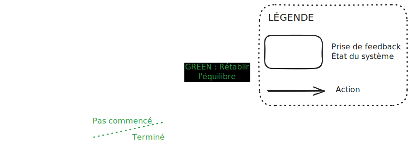

+++
date = '2025-04-06T08:07:52+02:00'
draft = true
title = 'Feedback rules (the world) - Partie 2 - TDD versus Feedback Rules'
+++

# Introduction

Dans [l'article précédent](../feedback_rules_the_world_part_1), nous avons découvert le schéma suivant : 

# Definition of done

Ce schéma est le principe d'une itération, et il permet de visualiser les différentes étapes de l'itération : 

- non commencée
- en cours
- terminée

Lorsque rien n'est commencé, nous sommes dans un état stable. Puis nous commençons, nous entrons dans un état instable. Enfin, lorsque nous terminons, nous revenons à un état stable.

TODO
- source de feedback
- est-ce que le feedback vient à nous ou est-ce qu'on doit aller le chercher
- coût du feedback en temps, energie, ressource
	- coût de mise en place du feedback
- délai avant de récupérer le feedback
- boucle de feedback
- double boucle de feedback
- le monde est instable en permanence, il faut viser le feedback 
- feedback mental
- feedback sensitif
- feedback technique
- feedback brut / feedback raffiné (traduit)
- détecter un déséquilibre / créer un déséquilibre
- déséquilibre, chaos / équilibre, stabilité

- exemple : initialiser une variable en TDD vs l'écrire directement
- feedback : definition of done

Présenter la boucle de feedback initiale